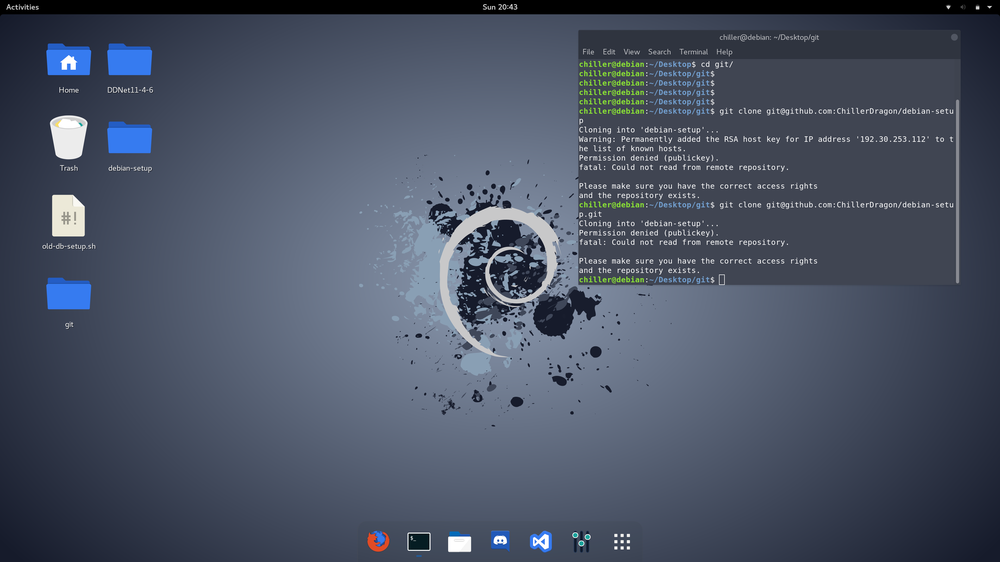

# debian-setup
A guide for noobs by a noob to install debian and set it up the chiller way.

It is a mix between a script and a documentation.
So make sure to read the whole setup-razer.sh (especially the comments) before executing it, or just follow this readme instead and don't touch the script at all.
And then if you have a fresh debian system running you can execute it to finish the setup.

The script is designed for razer blade stealth.
And it adds some personal customizations.
So make sure you like what i use or make changes in the debian-razer.sh before executing it.



# How to use?

You can either follow this readme and copy paste all the commands in your terminal.
Or you can use the ``debian-razer.sh`` script that guides you through the same process.


Assuming you have a fresh installed debian with network connection.
More details on how to set it up and comments on all the following commands can be found in the comments of the debian-razer.sh script.

Sudo and update
---------------

If used a CD image remove cdrom repos to connect to network.
```
sed '/^deb cdrom:.*/ s/deb cdrom:/# deb cdrom:/' /etc/apt/sources.list | sudo tee /etc/apt/sources.list
```
Check if the network connection is working. And update the system.
```
su root
apt-get update -y
apt-get upgrade -y
```
Then install sudo so you don't have to use the root user.
```
apt-get install sudo -y
```
replace chiller with your username of the account that is not root.
```
adduser chiller sudo
su chiller
sudo test
```
flat remix look
---------------
```
cd /tmp && rm -rf flat-remix-gtk &&
git clone https://github.com/daniruiz/flat-remix-gtk &&
mkdir -p ~/.themes && cp -r flat-remix-gtk/Flat-Remix-GTK* ~/.themes/ &&
gsettings set org.gnome.desktop.interface gtk-theme "Flat-Remix-GTK"

cd /tmp && rm -rf flat-remix &&
git clone https://github.com/daniruiz/flat-remix &&
mkdir -p ~/.icons && cp -r flat-remix/Flat-Remix* ~/.icons/ &&
gsettings set org.gnome.desktop.interface icon-theme "Flat-Remix"
```

dash to dock
------------

Now fix the dash menu and add a nice bottom dock.
Install dash to dock extension either in browser at:
https://extensions.gnome.org/
(You also want to allow the browser some stuff)
Or use gnome tweak tool and click:
extensions->Get more extensions
Then goto dash to dock settings and set the menu bar where you want
```
gnome-tweak-tool
```

start path (alias)
------------------
This alias allows to launch the files browser from commandline
in the windows style by typing 'start <path>'
```
echo "alias start='xdg-open'" >> ~/.bash_aliases
```

razer stealth related bugs
--------------------------

Let's fix some crucial bugs related to the razer blade stealth
They might occur on other razer laptops aswell.
Add the ``quiet button.lid_init_state=open`` kernel flag to your grub config by hand.
Or execute this command:
```
sed -i_$time_now.BACKUP -e '/^GRUB_CMDLINE_LINUX_DEFAULT=".*/ s/".*"/"quiet button.lid_init_state=open"/' /etc/default/grub
```


Installing curl and razer software
```
sudo apt-get install curl -y
curl https://download.opensuse.org/repositories/hardware:/razer/Debian_9.0/Release.key | sudo apt-key add -
echo 'deb http://download.opensuse.org/repositories/hardware:/razer/Debian_9.0/ /' | sudo tee /etc/apt/sources.list.d/hardware:razer.list
sudo apt-get update
sudo apt-get install openrazer-meta -y
```

Razer configs for X11
make sure the folder exsist
/usr/share/X11/xorg.conf.d
if not it might be the wrong place
try to execute a find command to find it
``sudo find / -name "*xorg.conf*"``
If you found the correct config folder execute this (you might want to change the path if your config folder is somewhere else):
```
echo '
Section "InputClass"

    Identifier "Disable built-in keyboard"
    MatchIsKeyboard "on" MatchProduct "AT Raw Set 2 keyboard" Option "Ignore" "true"

EndSection
' > sudo tee /usr/share/X11/xorg.conf.d/20-razer-kbd.conf
```
Another config in a different file:
```
echo '
#!/bin/sh
case $1 in
    suspend|suspend_hybrid|hibernate) # everything is fine ;;
    resume|thaw) xinput set-prop "AT Raw Set 2 keyboard" "Device Enabled" 0
    ;;
esac
' > sudo tee /etc/pm/sleep.d/20_razer_kbd
chmod +x /etc/pm/sleep.d/20_razer_kbd
sudo apt-get install xinput -y
xinput set-prop "AT Raw Set 2 keyboard" "Device Enabled" 0
```

If you encounter any problems the debian-razer.sh script has a lot of comments.
